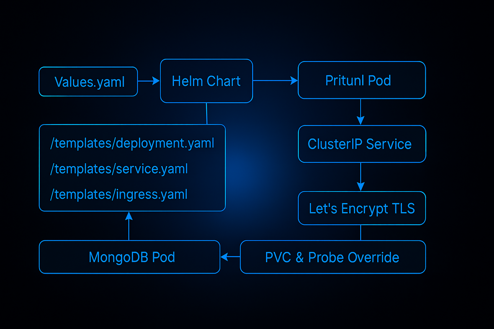

# 🚀 vpn-pritunl Helm Chart




Secure, production-ready Helm chart to deploy [Pritunl Zero](https://github.com/pritunl/pritunl-zero) with optional MongoDB and OIDC integration. Built for Kubernetes clusters using Ingress, TLS, and GitHub Actions.

---

## 📦 Overview

This Helm chart bootstraps a complete Pritunl Zero stack:

- 🌐 NGINX Ingress with TLS (cert-manager)
- 🔐 OIDC SSO login support (Keycloak, Auth0)
- 💾 Embedded MongoDB (Bitnami compatible)
- ⚙️ Configurable health checks and probes
- ✅ GitHub Actions CI: lint + dry-run validated

---

## 📁 Chart Structure

```text
vpn-pritunl-helm-chart/
├── charts/
├── templates/
│   ├── _helpers.tpl
│   ├── deployment.yaml
│   ├── ingress.yaml
│   ├── certificate.yaml
│   ├── override-mongo-probes.yaml
│   └── service.yaml
├── dev-values.yaml
├── values.yaml
└── Chart.yaml
```

---

## 🔧 Quick Start

Install into a namespace:

```bash
helm upgrade --install vpn-pritunl ./ \
  -f dev-values.yaml \
  --namespace vpn --create-namespace
```

> You must pre-install cert-manager and NGINX Ingress.

---

## 🧪 Values Overview

### MongoDB

```yaml
mongodb:
  enabled: true
  auth:
    rootPassword: your-root-password
    username: your-db-username
    password: your-db-password
    database: your-db-name
```

### OIDC Authentication

```yaml
pritunl:
  oidc:
    enabled: true
    client_id: your-client-id
    client_secret: your-client-secret
    issuer_url: https://auth.example.com
    redirect_uri: https://vpn.example.com/auth/callback
```

Create your secret:

```yaml
apiVersion: v1
kind: Secret
metadata:
  name: pritunl-secret
type: Opaque
stringData:
  oidc-client-id: your-client-id
  oidc-client-secret: your-client-secret
```

---

## 🔐 Ingress + TLS

```yaml
ingress:
  enabled: true
  className: nginx
  clusterIssuer: letsencrypt-staging
  host: vpn.example.com
  tlsSecret: pritunl-tls
```

---

## 🧪 CI Commands

```bash
helm lint .
helm template vpn-pritunl . -f dev-values.yaml
```

---

## 📄 License

MIT — free to use, contribute, and adapt.

---

## 🧠 Maintainer

**Temitayo Charles Akinniranye**  
DevOps Engineer  
[GitHub](https://github.com/temitayocharles) • [Portfolio](https://www.meetcharlie.live)
