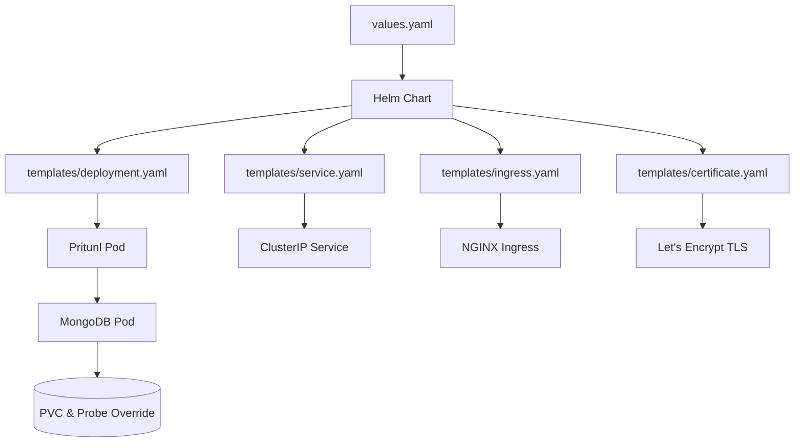

## 🧭 Deployment Flow

```mermaid
graph TD
  A[values.yaml] --> B[Helm Chart]
  B --> C[templates/deployment.yaml]
  B --> D[templates/service.yaml]
  B --> E[templates/ingress.yaml]
  B --> F[templates/certificate.yaml]

  C --> G[Pritunl Pod]
  D --> H[ClusterIP Service]
  E --> I[NGINX Ingress]
  F --> J[Let's Encrypt TLS]

  G --> K[MongoDB Pod]
  K --> L[(PVC & Probe Override)]
```

> This chart represents how configuration flows from Helm into Kubernetes workloads, networking, and TLS.

